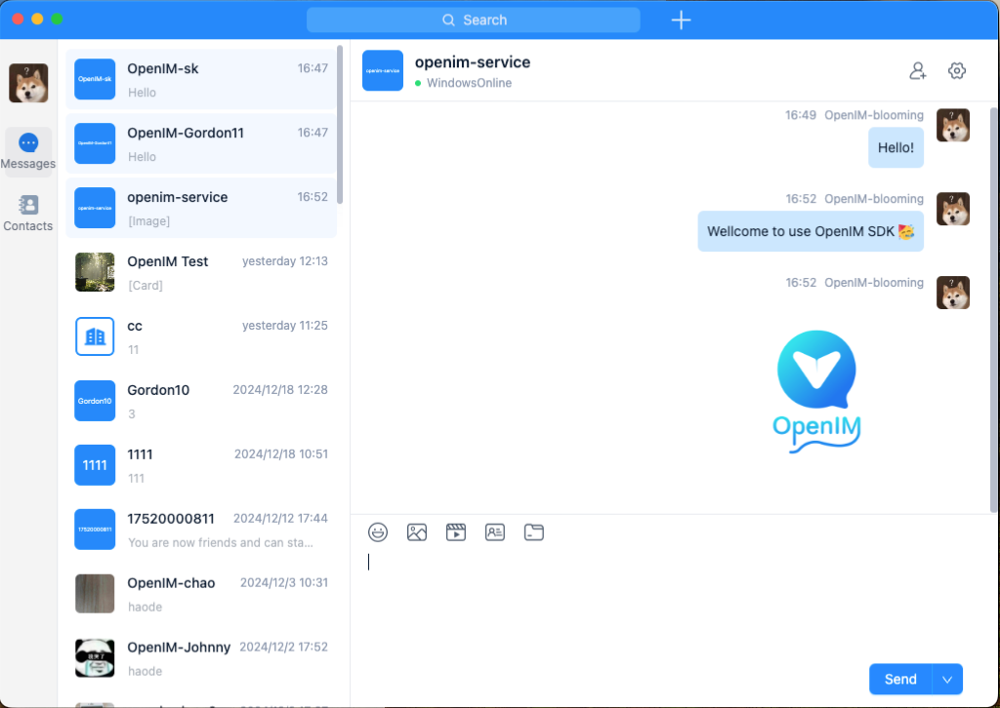

<p align="center">
    <a href="https://openim.io">
        
    </a>
</p>

# OpenIM Electron 💬💻

<p>
  <a href="https://docs.openim.io/">OpenIM Docs</a>
  •
  <a href="https://github.com/openimsdk/open-im-server">OpenIM Server</a>
  •
  <a href="https://github.com/openimsdk/openim-sdk-js-wasm">openim-sdk-wasm</a>
  •
  <a href="https://github.com/openimsdk/openim-sdk-electron">openim-sdk-electron</a>
  •
  <a href="https://github.com/openimsdk/openim-sdk-core">openim-sdk-core</a>
</p>

OpenIM provides an open-source Instant Messaging (IM) SDK for developers, serving as an alternative solution to cloud services like Twilio and Sendbird. With OpenIM, developers can build secure and reliable IM applications similar to WeChat, Zoom, and Slack.

This repository is based on the open-source version of the OpenIM SDK, offering an Electron-based IM application. You can use this application as a reference implementation of the OpenIM SDK. It references both `@openim/electron-client-sdk` and `@openim/wasm-client-sdk`, which are the Electron and Web versions of the SDK, respectively. This enables the creation of both PC Web applications and desktop applications (Windows, macOS, Linux).

<p align="center">
    
</p>

## License :page_facing_up:

This repository adopts the GNU Affero General Public License v3 (AGPL-3.0) with additional terms. **Commercial use is not permitted.** For more details, please refer to [here](./LICENSE).

## Development Environment

Before you start developing, please ensure that your system has the following software installed:

- **Operating System**: Windows 10 or above, macOS 10.15 or above
- **Node.js**: Version ≥ 16.x ([manual installation](https://nodejs.org/dist/latest-v20.x/) or via [nvm](https://github.com/nvm-sh/nvm))
- **npm**: Version ≥ 6.x (installed with Node.js)
- **Git**: For version control

You also need to have the latest version of the [OpenIM Server deployed](https://docs.openim.io/guides/gettingStarted/dockerCompose). After that, you can compile this project and connect it to your own server for testing.

## Runtime Environment

This application supports the following browsers and operating system versions:

| Browser/OS  | Version              | Status |
| ----------- | -------------------- | ------ |
| **Chrome**  | 78 and above         | ✅     |
| **Windows** | Windows 10 and above | ✅     |
| **macOS**   | 10.15 and above      | ✅     |
| **Linux**   | 20.04 and above      | ✅     |

### Note

- **Chrome**: It is recommended to use the latest version for the best experience.
- **Operating System**: Make sure your system meets the version requirements to avoid compatibility issues.

## Quick Start

Follow these steps to set up your local development environment:

1. Clone the repository

   ```bash
   git clone https://github.com/openimsdk/openim-electron-demo.git
   cd openim-electron-demo
   ```

2. Install dependencies

   ```bash
   npm install
   ```

3. Modify the configuration

   - In the `.env` file:

     > If you haven't changed the default server port, simply change `VITE_BASE_HOST` to your server IP. If you need to set up a domain and HTTPS access, please refer to [nginx configuration](https://docs.openim.io/guides/gettingStarted/nginxDomainConfig), use the configuration at the bottom, and modify `VITE_BASE_DOMAIN` to your domain name.

     ```bash
     VITE_BASE_HOST=your-server-ip

     VITE_WS_URL=ws://$VITE_BASE_HOST:10001
     VITE_API_URL=http://$VITE_BASE_HOST:10002
     VITE_CHAT_URL=http://$VITE_BASE_HOST:10008

     # VITE_BASE_DOMAIN=your-server-domain

     # VITE_WS_URL=wss://$VITE_BASE_DOMAIN/msg_gateway
     # VITE_API_URL=https://$VITE_BASE_DOMAIN/api
     # VITE_CHAT_URL=https://$VITE_BASE_DOMAIN/chat
     ```

4. Run `npm run dev` to start the development server. Access [http://localhost:5173](http://localhost:5173) to view the result. By default, the Electron application will also start.

5. Start developing and testing! 🎉

## Audio/Video Calls

The open-source version supports one-to-one audio and video calls. You need to first deploy and configure the [server](https://github.com/openimsdk/chat/blob/main/HOW_TO_SETUP_LIVEKIT_SERVER.md). For multi-party audio/video calls or video conferencing, please contact us at [contact@openim.io](mailto:contact@openim.io).

### Note

- To enable audio and video calls on the web, you can only debug locally (localhost) or deploy the application to an HTTPS site for use. This limitation is due to browser security policies.

## Build 🚀

> This project allows separate builds for the Web application and the Electron application, but there are some differences in the build process.

### Web Application

1. Run the following command to build the Web application:
   ```bash
   npm run build
   ```
2. The build artifacts will be located in the `dist` directory.

### Electron Application

1. Replace the content of `package.json` with the content from `package_electron.json`, retaining only the dependencies required by Electron. This significantly reduces the package size. Also, modify the build scripts accordingly.

2. On the corresponding system, run one of the following commands to build the Electron application:

   > For cross-compilation, it is only supported to build other system installers on macOS. On Windows or Linux, you can only build installers for the same system.

   - macOS:
     ```bash
     npm run build:mac
     ```
   - Windows:
     ```bash
     npm run build:win
     ```
   - Linux:
     ```bash
     npm run build:linux
     ```

3. The build artifacts will be located in the `release` directory.

## Features

### Description

| Feature Module             | Feature                                                                          | Status |
| -------------------------- | -------------------------------------------------------------------------------- | ------ |
| **Account Features**       | Phone number registration \ Email registration \ Verification code login         | ✅     |
|                            | View \ Edit personal information                                                 | ✅     |
|                            | Multi-language settings                                                          | ✅     |
|                            | Change password \ Forgot password                                                | ✅     |
| **Friend Features**        | Find \ Apply \ Search \ Add \ Delete friends                                     | ✅     |
|                            | Accept \ Reject friend requests                                                  | ✅     |
|                            | Friend notes                                                                     | ✅     |
|                            | Allow friend requests or not                                                     | ✅     |
|                            | Friend list \ Friend data real-time syncing                                      | ✅     |
| **Blocklist**              | Restrict messages                                                                | ✅     |
|                            | Real-time syncing of blocklist                                                   | ✅     |
|                            | Add \ Remove from blocklist                                                      | ✅     |
| **Group Features**         | Create \ Dismiss groups                                                          | ✅     |
|                            | Apply to join \ Invite to join \ Leave group \ Remove members                    | ✅     |
|                            | Group name / Avatar changes / Group data updates (notifications, real-time sync) | ✅     |
|                            | Invite members to group                                                          | ✅     |
|                            | Transfer group ownership                                                         | ✅     |
|                            | Group owner or admin approve join requests                                       | ✅     |
|                            | Search group members                                                             | ✅     |
| **Message Features**       | Offline messages                                                                 | ✅     |
|                            | Roaming messages                                                                 | ✅     |
|                            | Multi-end messages                                                               | ✅     |
|                            | Message history                                                                  | ✅     |
|                            | Message deletion                                                                 | ✅     |
|                            | Clear messages                                                                   | ✅     |
|                            | Copy messages                                                                    | ✅     |
|                            | Typing indicator in single chat                                                  | ✅     |
|                            | Do Not Disturb for new messages                                                  | ✅     |
|                            | Clear chat history                                                               | ✅     |
|                            | New members can view group chat history                                          | ✅     |
|                            | New message reminders                                                            | ✅     |
|                            | Text messages                                                                    | ✅     |
|                            | Image messages                                                                   | ✅     |
|                            | Video messages                                                                   | ✅     |
|                            | Emoji messages                                                                   | ✅     |
|                            | File messages                                                                    | ✅     |
|                            | Voice messages                                                                   | ✅     |
|                            | Contact card messages                                                            | ✅     |
|                            | Location messages                                                                | ✅     |
|                            | Custom messages                                                                  | ✅     |
| **Conversation**           | Pin conversation                                                                 | ✅     |
|                            | Mark conversation as read                                                        | ✅     |
|                            | Mute conversation                                                                | ✅     |
| **REST API**               | Authentication management                                                        | ✅     |
|                            | User management                                                                  | ✅     |
|                            | Relationship chain management                                                    | ✅     |
|                            | Group management                                                                 | ✅     |
|                            | Conversation management                                                          | ✅     |
|                            | Message management                                                               | ✅     |
| **Webhook**                | Group callbacks                                                                  | ✅     |
|                            | Message callbacks                                                                | ✅     |
|                            | Push callbacks                                                                   | ✅     |
|                            | Relationship callbacks                                                           | ✅     |
|                            | User callbacks                                                                   | ✅     |
| **Capacity & Performance** | 10,000 friends                                                                   | ✅     |
|                            | 100,000-member supergroup                                                        | ✅     |
|                            | Second-level syncing                                                             | ✅     |
|                            | Cluster deployment                                                               | ✅     |
|                            | Multi-device kick-out strategy                                                   | ✅     |
| **Online Status**          | No mutual kick-out across all platforms                                          | ✅     |
|                            | Each platform can only log in with one device                                    | ✅     |
|                            | PC, Mobile, Pad, Web, Mini Program each can log in with one device               | ✅     |
|                            | PC not mutually kicked, only one device total for other platforms                | ✅     |
| **Audio/Video Call**       | One-to-one audio and video calls                                                 | ✅     |
| **File Storage**           | Supports private Minio deployment                                                | ✅     |
|                            | Supports public cloud services COS, OSS, Kodo, S3                                | ✅     |
| **Push**                   | Real-time online message push                                                    | ✅     |
|                            | Offline message push, supports Getui, Firebase                                   | ✅     |

For more advanced features, audio/video calls, or video conferences, please contact us at [contact@openim.io](mailto:contact@openim.io).

## Join Our Community :busts_in_silhouette:

- 🚀 [Join our Slack community](https://join.slack.com/t/openimsdk/shared_invite/zt-22720d66b-o_FvKxMTGXtcnnnHiMqe9Q)
- :eyes: [Join our WeChat group](https://openim-1253691595.cos.ap-nanjing.myqcloud.com/WechatIMG20.jpeg)

## FAQ

1. **When publishing to the web, how to solve slow WASM loading?**

   Answer: Use gzip compression on the WASM file to significantly reduce the size. You can also leverage a CDN to accelerate loading.

2. **CKEditorError: ckeditor-duplicated-modules**

   Answer: This is due to dependency conflicts. Run `npm dedupe` to clean up dependencies.
